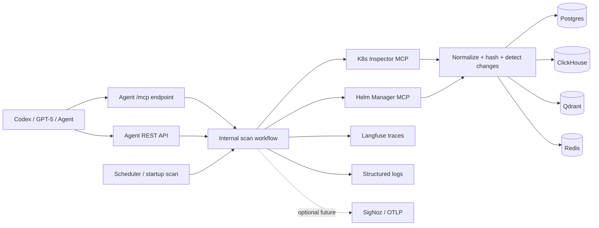
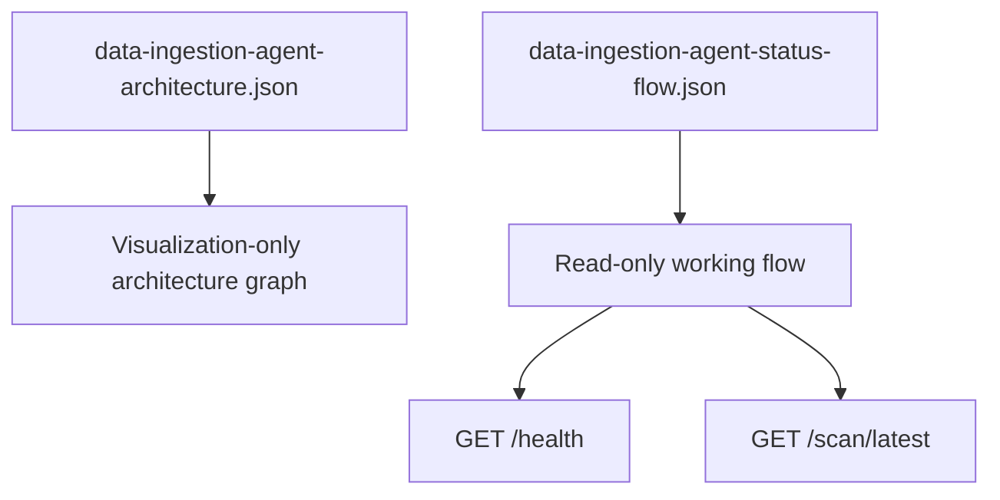

# BOS Genesis K8s Data Ingestion Agent - Specification

**Document status:** Implemented baseline  
**Service name:** `bosgenesis-k8s-data-ingestion-agent`  
**Python package:** `bosgenesis_k8s_data_ingestion_agent`  
**Namespace:** `bosgenesis`  
**Primary mode:** Kubernetes service with REST API, remote MCP endpoint, scheduler, and optional worker-style startup scan  
**Execution posture:** Read-only collection, deterministic ETL, configurable sinks, Langfuse tracing

---

## 1. Purpose

The BOS Genesis K8s Data Ingestion Agent collects operational state from the BOS Genesis Kubernetes namespace by calling existing MCP servers. It normalizes the collected data, computes stable hashes, detects changed records, writes enabled sinks, and emits Langfuse traces.

The agent is not a remediation service. It does not mutate Kubernetes, Helm, databases, or application resources.

---

## 2. Implemented Architecture



---

## 3. In Scope

- Expose REST endpoints:
  - `GET /health`
  - `POST /scan/run`
  - `GET /scan/latest`
  - `GET /config/effective`
- Expose remote MCP endpoint at `/mcp`.
- Provide MCP tools:
  - `data_ingestion_health`
  - `data_ingestion_run_scan`
  - `data_ingestion_latest_scan`
  - `data_ingestion_effective_config`
- Use K8s Inspector MCP read tools only.
- Use Helm Manager MCP read tools only.
- Normalize Kubernetes and Helm responses into canonical observations.
- Compute stable content hashes.
- Write changed records to enabled sinks.
- Trace scan lifecycle with Langfuse.
- Provide visualization-only and read-only working Langflow flow JSON files.

---

## 4. Out of Scope

- Kubernetes mutation.
- Helm mutation.
- Secret collection.
- Direct `kubectl` or `helm` shell execution.
- Autonomous remediation.
- Anomaly detection.
- Alerting.
- LangChain/LangGraph orchestration. The current workflow is deterministic ETL and does not require LLM chain orchestration.

---

## 5. External Dependencies

### 5.1 K8s Inspector MCP

In-cluster URL:

```text
http://bosgenesis-k8s-inspector-mcp.bosgenesis.svc.cluster.local:8080/mcp
```

Host header:

```text
k8s-inspector.bosgenesis.local
```

### 5.2 Helm Manager MCP

In-cluster URL:

```text
http://bosgenesis-helm-manager-mcp.bosgenesis.svc.cluster.local:8080/mcp
```

Host header:

```text
helm-manager.bosgenesis.local
```

### 5.3 Langfuse

The pod must use Kubernetes service DNS:

```text
http://langfuse-web.bosgenesis.svc.cluster.local:3000
```

The UI/ingress hostname may differ and should not be used by the pod unless cluster DNS can resolve it.

---

## 6. Functional Requirements

| ID | Requirement | Status |
|---|---|---|
| FR-1 | Run as FastAPI service. | Implemented |
| FR-2 | Expose `/mcp` Streamable HTTP MCP endpoint. | Implemented |
| FR-3 | Support on-demand scan through REST. | Implemented |
| FR-4 | Support on-demand scan through MCP. | Implemented |
| FR-5 | Support scheduled/startup scans. | Implemented |
| FR-6 | Call only allowlisted K8s MCP read tools. | Implemented |
| FR-7 | Call only allowlisted Helm MCP read tools. | Implemented |
| FR-8 | Normalize collected records. | Implemented |
| FR-9 | Compute stable hashes. | Implemented |
| FR-10 | Detect changed records. | Implemented |
| FR-11 | Write Postgres sink when enabled. | Implemented |
| FR-12 | Write ClickHouse sink when enabled. | Implemented |
| FR-13 | Write Qdrant memory sink when enabled. | Implemented |
| FR-14 | Write Redis latest-state sink when enabled. | Implemented |
| FR-15 | Emit Langfuse traces when enabled and configured. | Implemented |
| FR-16 | Allow sink enablement overrides from `deploy.sh`. | Implemented |
| FR-17 | Provide Langflow visualization artifact. | Implemented |
| FR-18 | Provide read-only working Langflow status flow. | Implemented |

---

## 7. Configuration

Important runtime settings:

```text
NAMESPACE=bosgenesis
API_HOST=0.0.0.0
API_PORT=8080
MCP_ALLOWED_HOSTS=data-ingestion-agent.bosgenesis.local,...

K8S_MCP_URL=http://bosgenesis-k8s-inspector-mcp.bosgenesis.svc.cluster.local:8080/mcp
K8S_MCP_HOST_HEADER=k8s-inspector.bosgenesis.local

HELM_MCP_URL=http://bosgenesis-helm-manager-mcp.bosgenesis.svc.cluster.local:8080/mcp
HELM_MCP_HOST_HEADER=helm-manager.bosgenesis.local

POSTGRES_ENABLED=true
CLICKHOUSE_ENABLED=true
QDRANT_ENABLED=true
REDIS_ENABLED=true
STDOUT_ENABLED=false

LANGFUSE_ENABLED=true
LANGFUSE_BASE_URL=http://langfuse-web.bosgenesis.svc.cluster.local:3000
LANGFUSE_PUBLIC_KEY=<from secret>
LANGFUSE_SECRET_KEY=<from secret>
```

`playbook/deploy.sh` can override sink enablement at deployment time. Defaults enable Postgres, ClickHouse, Qdrant, and Redis.

---

## 8. Scan Summary Contract

```json
{
  "run_id": "uuid",
  "correlation_id": "uuid",
  "namespace": "bosgenesis",
  "status": "success",
  "started_at": "timestamp",
  "finished_at": "timestamp",
  "resources_seen": 258,
  "resources_changed": 34,
  "helm_releases_seen": 0,
  "helm_releases_changed": 0,
  "sinks_used": ["postgres", "clickhouse", "qdrant", "redis"],
  "trace_ids": {
    "langfuse": "trace-id"
  },
  "errors": []
}
```

---

## 9. Langflow Artifacts



Files:

- `langflow/data-ingestion-agent-architecture.json`
- `langflow/data-ingestion-agent-status-flow.json`

---

## 10. Acceptance Criteria

- `/health` returns safe effective configuration with secrets redacted.
- `/mcp` exposes all four data-ingestion MCP tools.
- `data_ingestion_run_scan` returns a successful scan summary.
- Langfuse shows trace root `data-ingestion.scan` with child spans.
- Pod-side Langfuse base URL uses `langfuse-web.bosgenesis.svc.cluster.local:3000`.
- Optional sinks can be enabled or disabled from Helm values and `deploy.sh`.
- No secrets are committed.
- No Kubernetes or Helm mutation tools are called.
