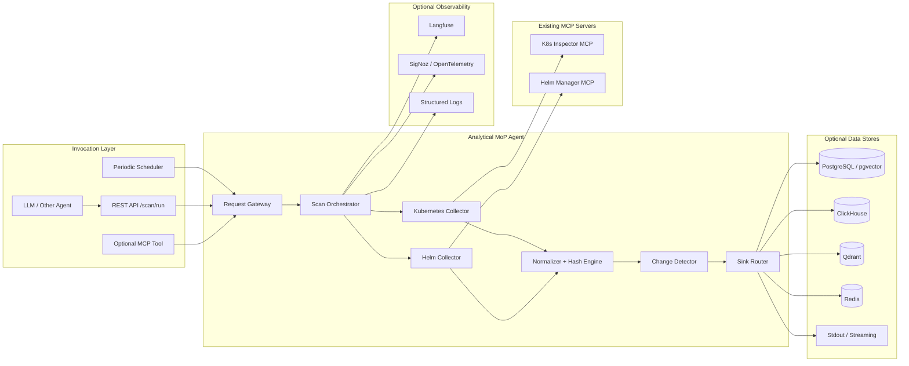
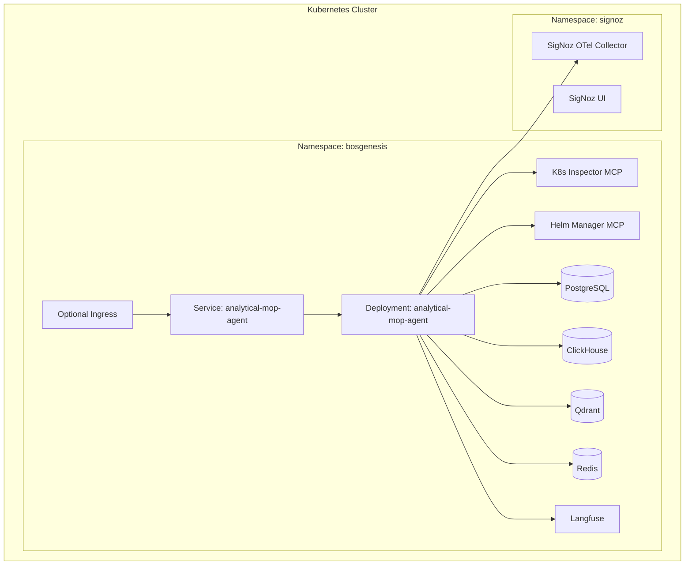
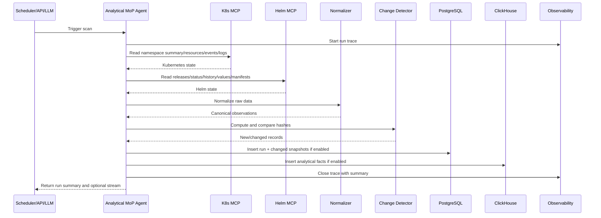
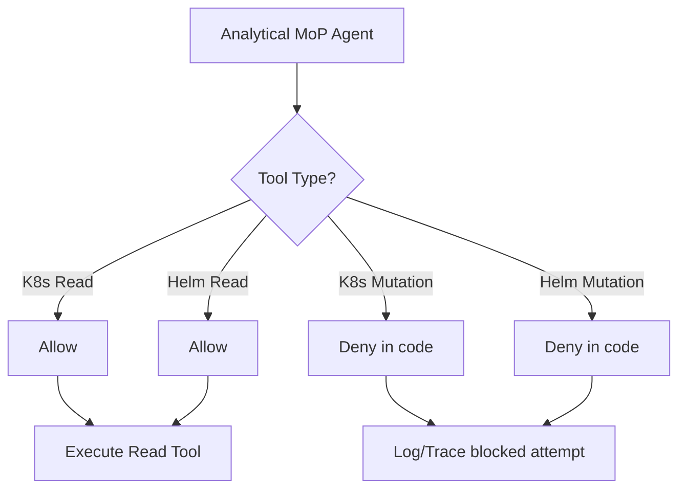
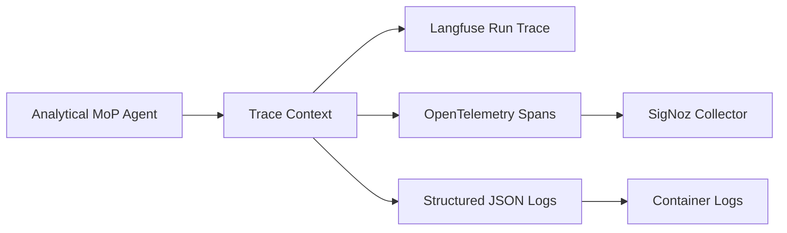
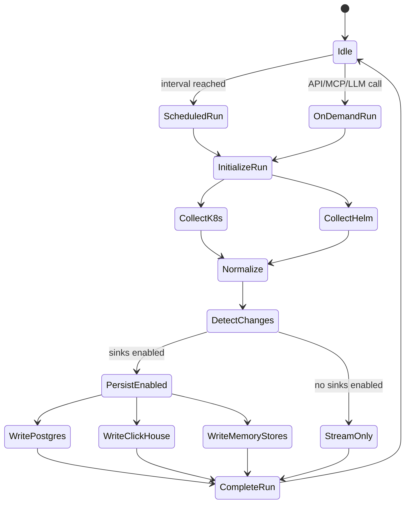

# Analytical MoP Agent — High Level Design

**Document status:** Draft v1.0  
**Target platform:** BOS Genesis / BOS AI Studio  
**Agent name:** `analytical-mop-agent`  

---

## 1. Executive Summary

The Analytical MoP Agent is a read-only, periodic, ETL-style agent for Kubernetes operational state collection. It uses the existing BOS Genesis Kubernetes Inspector MCP and Helm Manager MCP servers to scan a namespace, collect resource and Helm release data, normalize the collected data, detect changes through hashing, and persist the resulting facts into PostgreSQL and ClickHouse when enabled.

It is not a remediation agent. It does not perform anomaly detection or alerts. It creates the analytical and machine-learning-ready data layer required by future MoP generation, anomaly detection, SRE analytics, and decision-support agents.

---

## 2. High-Level Architecture



---

## 3. Major Capabilities

| Capability | Description |
|---|---|
| Periodic scan | Runs on a configurable interval. |
| On-demand scan | Callable through REST/API/MCP. |
| Kubernetes collection | Uses K8s MCP read tools for pods, deployments, services, PVCs, ingresses, events, logs. |
| Helm collection | Uses Helm MCP read tools for releases, status, values, manifests, history. |
| Change detection | Uses stable hashes to persist only changed data. |
| PostgreSQL persistence | Stores normalized scan runs and resource snapshots for ML. |
| ClickHouse persistence | Stores analytical facts and event-style data for dashboards. |
| Memory integration | Optional Qdrant, pgvector, Redis, LangMem-style memory hooks. |
| Observability | Optional Langfuse traces and SigNoz OTel spans. |
| Fallback mode | Streams/prints result if all sinks are disabled. |

---

## 4. Deployment Context



---

## 5. Component Responsibilities

### 5.1 Request Gateway

Receives scan requests from scheduler, REST API, optional MCP tool, or LLM-triggered caller. It creates `run_id`, `correlation_id`, and run context.

### 5.2 Scan Orchestrator

Coordinates the full run lifecycle:

1. Start trace.
2. Collect Kubernetes facts.
3. Collect Helm facts.
4. Normalize data.
5. Detect changes.
6. Persist or stream output.
7. Write run summary.
8. Close trace.

### 5.3 Kubernetes Collector

Calls Kubernetes Inspector MCP read tools only. It never calls write or mutation tools.

### 5.4 Helm Collector

Calls Helm Manager MCP read tools only. It never calls install, upgrade, uninstall, or rollback tools.

### 5.5 Normalizer + Hash Engine

Transforms raw MCP responses into canonical records. Removes volatile fields where needed and computes stable hashes.

### 5.6 Change Detector

Compares current hash against latest known hash from PostgreSQL or Redis. If no persistence is available, it treats all records as output records.

### 5.7 Sink Router

Routes records to configured sinks:

- PostgreSQL sink.
- ClickHouse sink.
- Qdrant sink.
- pgvector sink.
- Redis cache sink.
- LangMem sink.
- disabled Letta adapter.
- stdout/streaming fallback.

### 5.8 Observability Layer

Emits:

- Langfuse trace per run.
- OpenTelemetry spans per run, collector, MCP call, normalization, and sink operation.
- Structured logs.

---

## 6. Data Flow



---

## 7. Read-Only Tool Policy

The Analytical MoP Agent must only use read tools from both MCP servers.



---

## 8. Storage Strategy

### 8.1 PostgreSQL

PostgreSQL is the source of truth for normalized scan runs and changed snapshots. It is suitable for later supervised ML feature engineering and exact historical queries.

### 8.2 ClickHouse

ClickHouse stores event/fact tables optimized for trend analysis, dashboarding, and later anomaly detection. It should receive compact analytical rows rather than very large raw payloads.

### 8.3 Qdrant / pgvector

Qdrant and pgvector are optional semantic memory stores. They can store compact textual summaries of operational observations such as:

- "deployment memory-agent had 3 ready replicas and no restarts"
- "helm release langflow revision changed from 3 to 4"
- "pod status changed from Pending to Running"

### 8.4 Redis

Redis can cache latest hashes and latest namespace summary to avoid repeated database reads.

### 8.5 Letta

Letta adapter remains present but disabled. It should not be initialized unless explicitly enabled in future.

---

## 9. Observability Design



Recommended span names:

```text
analytical_mop.scan.start
analytical_mop.k8s.collect
analytical_mop.helm.collect
analytical_mop.normalize
analytical_mop.change_detect
analytical_mop.sink.postgres
analytical_mop.sink.clickhouse
analytical_mop.sink.qdrant
analytical_mop.sink.redis
analytical_mop.scan.complete
```

---

## 10. Failure Handling

| Failure | Default Behavior |
|---|---|
| K8s MCP unavailable | Mark partial failure; continue Helm if enabled. |
| Helm MCP unavailable | Mark partial failure; continue K8s if enabled. |
| PostgreSQL unavailable | Skip sink in non-strict mode; trace error. |
| ClickHouse unavailable | Skip sink in non-strict mode; trace error. |
| Langfuse unavailable | Continue; log tracing failure. |
| SigNoz unavailable | Continue; log OTel export failure. |
| All sinks disabled | Stream/print result to caller/stdout. |

---

## 11. HLD Mermaid — Run Lifecycle



---

## 12. HLD Decision Summary

| Decision | Choice |
|---|---|
| Runtime style | Long-running service with scheduler + API. |
| Agent behavior | Read-only ETL scanner. |
| Tool access | Existing K8s MCP and Helm MCP read tools only. |
| Persistence | Optional PostgreSQL and ClickHouse first. |
| Memory | Optional Qdrant, pgvector, Redis, LangMem. |
| Letta | Adapter available but disabled. |
| Observability | Langfuse + SigNoz optional and configurable. |
| Fallback | Stream/print if all sinks disabled. |
