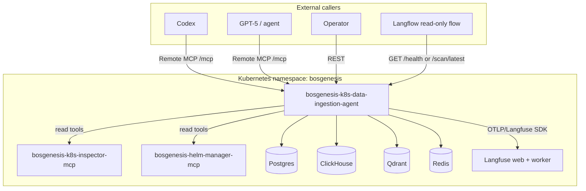
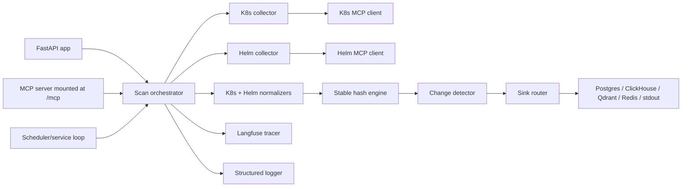
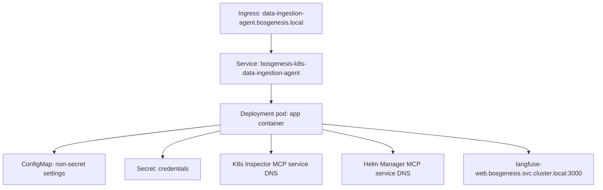
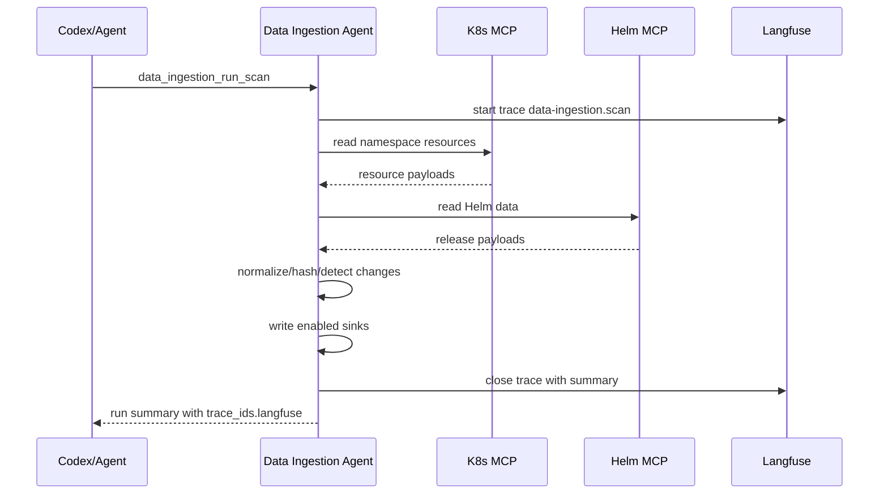

# BOS Genesis K8s Data Ingestion Agent - High Level Design

**Document status:** Implemented baseline  
**Service:** `bosgenesis-k8s-data-ingestion-agent`  
**Namespace:** `bosgenesis`

---

## 1. Executive Summary

The agent is a read-only operational data collector for BOS Genesis. It exposes REST and remote MCP interfaces, uses existing Kubernetes and Helm MCP servers as controlled read boundaries, persists changed observations to optional sinks, and emits Langfuse traces for each scan.

The design favors explicit deterministic code over LLM orchestration frameworks. MCP is the tool boundary; Langfuse is the tracing plane; sinks are independently configurable.

---

## 2. System Context



---

## 3. Major Runtime Interfaces

| Interface | URL / Path | Purpose |
|---|---|---|
| REST health | `/health` | Health and safe effective config. |
| REST run scan | `/scan/run` | Trigger one scan. |
| REST latest scan | `/scan/latest` | Return latest in-memory summary. |
| REST config | `/config/effective` | Return redacted effective config. |
| Remote MCP | `/mcp` | MCP tool surface for Codex/agents. |
| Langflow status flow | `langflow/data-ingestion-agent-status-flow.json` | Read-only status flow. |

---

## 4. Internal Components



---

## 5. Deployment Context



Runtime URLs inside the pod use service DNS, not external ingress names, for MCP dependencies and Langfuse.

---

## 6. Observability Flow



Langfuse root trace:

```text
data-ingestion.scan
```

Implemented child spans:

```text
collect.kubernetes
collect.helm
normalize
hash
detect_changes
write_sinks
write_memory
```

---

## 7. Safety Design

| Safety rule | Design choice |
|---|---|
| No direct Kubernetes access | Agent calls K8s MCP instead of Kubernetes API. |
| No direct Helm mutation | Agent calls Helm MCP read operations only. |
| No secret collection | Collectors avoid Kubernetes Secrets. |
| No raw shell tooling | No `kubectl` or `helm` shell execution path. |
| No LLM planner | Deterministic orchestrator avoids unreviewed autonomous behavior. |
| Redacted health/config | Secret settings are redacted from safe config output. |

---

## 8. Runtime Decisions

| Decision | Current implementation |
|---|---|
| API framework | FastAPI |
| MCP transport | Streamable HTTP mounted at `/mcp` |
| Langfuse | Enabled by default, disableable by config |
| Langfuse URL | `http://langfuse-web.bosgenesis.svc.cluster.local:3000` |
| Sink defaults | Postgres, ClickHouse, Qdrant, Redis enabled |
| Deploy sink override | `playbook/deploy.sh` prompt/env overrides |
| LangChain | Not used; not needed for deterministic ETL |
| Langflow | Importable visualization and read-only status flow |
