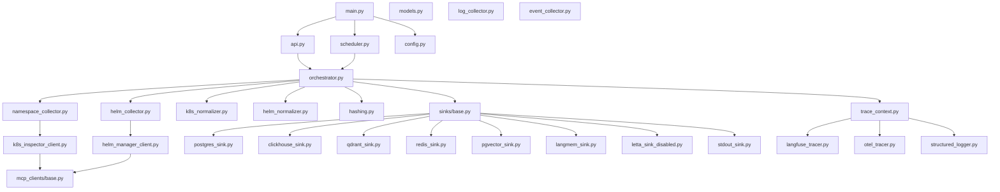
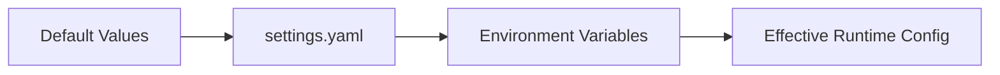
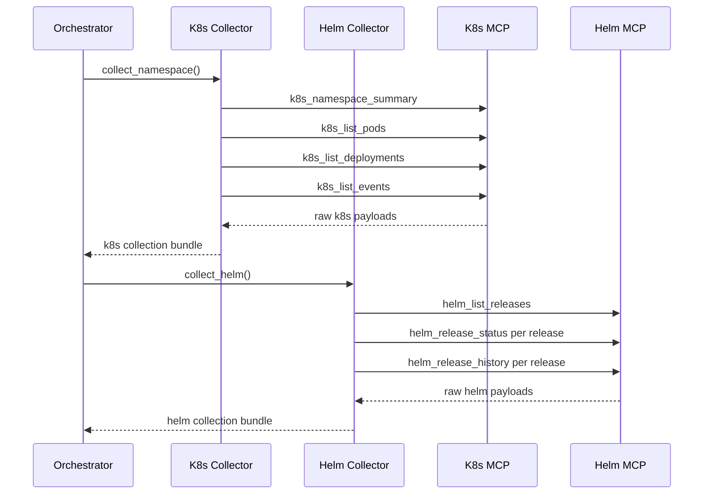
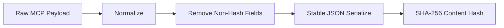
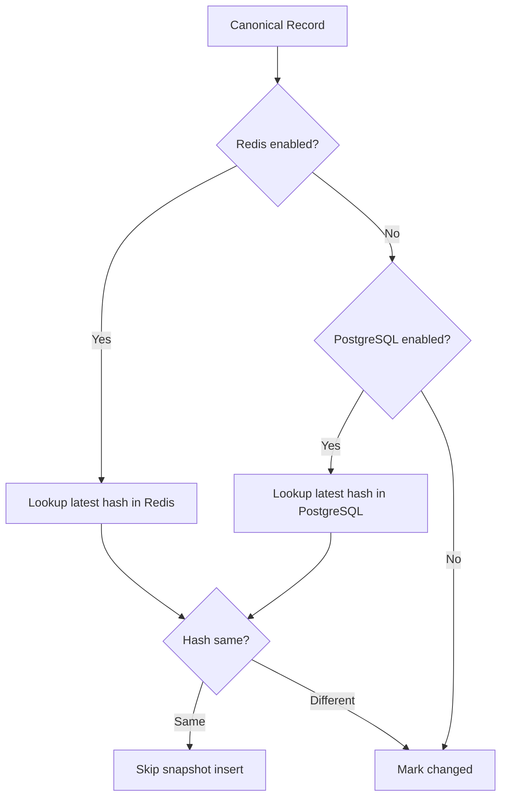
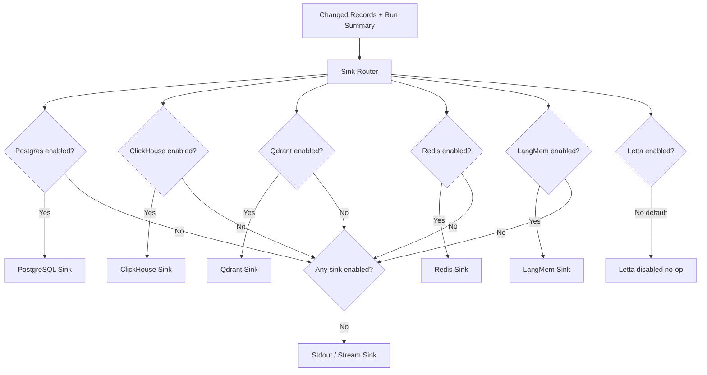
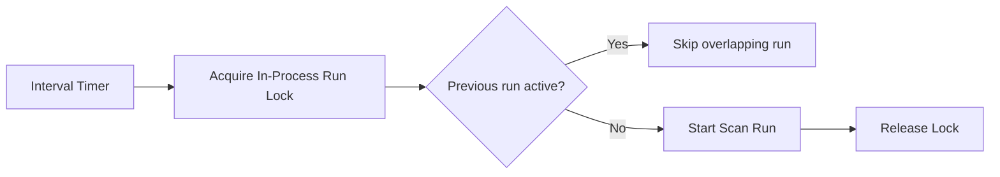

# Analytical MoP Agent — Low Level Design

**Document status:** Draft v1.0  
**Target platform:** BOS Genesis / BOS AI Studio  
**Agent name:** `analytical-mop-agent`  

---

## 1. Module Map



---

## 2. Runtime Entry Points

### 2.1 `main.py`

Responsibilities:

- Load configuration.
- Initialize tracing.
- Initialize sinks.
- Start FastAPI server when API is enabled.
- Start scheduler when scheduled mode is enabled.

### 2.2 `api.py`

REST endpoints:

| Endpoint | Method | Purpose |
|---|---:|---|
| `/health` | GET | Agent health and enabled components. |
| `/scan/run` | POST | Trigger immediate scan. |
| `/scan/latest` | GET | Return latest run summary if available. |
| `/config/effective` | GET | Return non-secret effective config. |

### 2.3 Optional MCP Tool Surface

Optional tool:

```text
analytical_mop_scan_namespace
```

Inputs:

```json
{
  "triggered_by": "llm|agent|manual",
  "include_logs": false,
  "include_manifests": false,
  "stream_result": true
}
```

Output:

```json
{
  "run_id": "uuid",
  "status": "success|partial_success|failed",
  "namespace": "bosgenesis",
  "resources_seen": 0,
  "resources_changed": 0,
  "helm_releases_seen": 0,
  "helm_releases_changed": 0,
  "sinks_used": ["postgres", "clickhouse"],
  "trace_ids": {
    "langfuse": "string|null",
    "signoz": "string|null"
  }
}
```

---

## 3. Configuration Model

### 3.1 Config Class Structure

```text
Settings
  AgentSettings
  ApiSettings
  McpSettings
    K8sInspectorSettings
    HelmManagerSettings
  SinkSettings
    PostgresSettings
    ClickHouseSettings
    QdrantSettings
    RedisSettings
    LangMemSettings
    LettaSettings
  ObservabilitySettings
    LangfuseSettings
    SignozSettings
    KafkaEventSettings
```

### 3.2 Config Resolution Order



---

## 4. MCP Client Design

### 4.1 Base MCP Client

Responsibilities:

- Initialize remote MCP session.
- List tools optionally during startup validation.
- Call named tool with arguments.
- Apply timeout and retry policy.
- Return structured payload.
- Never call non-allowlisted tools.

### 4.2 K8s MCP Tool Allowlist

```text
k8s_namespace_summary
k8s_list_pods
k8s_describe_pod
k8s_get_pod_logs
k8s_list_services
k8s_list_pvcs
k8s_describe_pvc
k8s_list_deployments
k8s_list_statefulsets
k8s_list_ingresses
k8s_list_events
```

### 4.3 Helm MCP Tool Allowlist

```text
helm_list_releases
helm_release_status
helm_release_history
helm_get_values
helm_get_manifest
helm_show_chart
helm_template_chart
helm_repo_list
```

### 4.4 Mutation Tool Denylist

The agent must explicitly deny:

```text
k8s_apply_manifest
k8s_create_resource
k8s_update_resource
k8s_delete_resource
k8s_patch_resource
k8s_scale_deployment
helm_install_release
helm_upgrade_release
helm_uninstall_release
helm_rollback_release
helm_repo_add
helm_repo_update
```

---

## 5. Collector Design

### 5.1 Namespace Collector

Collection steps:

1. Call `k8s_namespace_summary`.
2. Call `k8s_list_pods`.
3. Call `k8s_list_deployments`.
4. Call `k8s_list_statefulsets`.
5. Call `k8s_list_services`.
6. Call `k8s_list_ingresses`.
7. Call `k8s_list_pvcs`.
8. Call `k8s_list_events`.
9. Optionally call bounded `k8s_get_pod_logs` for selected pods only.

### 5.2 Helm Collector

Collection steps:

1. Call `helm_list_releases`.
2. For each release, call `helm_release_status`.
3. For each release, call `helm_release_history`.
4. For each release, optionally call `helm_get_values`.
5. For each release, optionally call `helm_get_manifest`.
6. Call `helm_repo_list` periodically or on demand.

### 5.3 Collector Sequence



---

## 6. Normalization and Hashing

### 6.1 Normalization Rules

Normalize records by:

- Keeping identity fields: kind, name, namespace, uid, chart, release, revision.
- Keeping status fields: phase, ready, replicas, restarts, status, reason.
- Keeping relationship fields: owner, app labels, service selectors, chart references.
- Keeping observed timestamp separately.
- Removing highly volatile fields from hash input when they do not represent meaningful change.

### 6.2 Hashing Rules

Hash input must be:

- JSON serialized with sorted keys.
- Stable across field order changes.
- Exclude collection timestamp.
- Include status fields if status changes should be captured.



---

## 7. Change Detection

### 7.1 Priority Lookup Strategy



### 7.2 Change Event Types

```text
created
updated
status_changed
deleted_or_missing_candidate
helm_revision_changed
helm_values_changed
helm_manifest_changed
unknown
```

Deleted/missing detection should be conservative in v1. The agent should mark missing candidates but not generate alerts.

---

## 8. Database Design

### 8.1 PostgreSQL Tables

```sql
CREATE TABLE analytical_mop_scan_runs (
  run_id UUID PRIMARY KEY,
  correlation_id UUID NOT NULL,
  agent_name TEXT NOT NULL,
  namespace TEXT NOT NULL,
  trigger_type TEXT NOT NULL,
  started_at TIMESTAMPTZ NOT NULL,
  completed_at TIMESTAMPTZ,
  status TEXT NOT NULL,
  resources_seen INT DEFAULT 0,
  resources_changed INT DEFAULT 0,
  helm_releases_seen INT DEFAULT 0,
  helm_releases_changed INT DEFAULT 0,
  error_count INT DEFAULT 0,
  summary JSONB DEFAULT '{}'::jsonb
);

CREATE TABLE analytical_mop_resource_snapshots (
  snapshot_id UUID PRIMARY KEY,
  run_id UUID REFERENCES analytical_mop_scan_runs(run_id),
  namespace TEXT NOT NULL,
  source TEXT NOT NULL,
  resource_type TEXT NOT NULL,
  resource_name TEXT NOT NULL,
  resource_uid TEXT,
  observed_at TIMESTAMPTZ NOT NULL,
  status_summary TEXT,
  content_hash TEXT NOT NULL,
  raw_payload JSONB,
  normalized_payload JSONB
);

CREATE INDEX idx_analytical_mop_resource_latest
ON analytical_mop_resource_snapshots(namespace, resource_type, resource_name, observed_at DESC);

CREATE TABLE analytical_mop_helm_snapshots (
  snapshot_id UUID PRIMARY KEY,
  run_id UUID REFERENCES analytical_mop_scan_runs(run_id),
  namespace TEXT NOT NULL,
  release_name TEXT NOT NULL,
  revision INT,
  chart TEXT,
  app_version TEXT,
  status TEXT,
  observed_at TIMESTAMPTZ NOT NULL,
  content_hash TEXT NOT NULL,
  values_hash TEXT,
  manifest_hash TEXT,
  raw_payload JSONB,
  normalized_payload JSONB
);

CREATE INDEX idx_analytical_mop_helm_latest
ON analytical_mop_helm_snapshots(namespace, release_name, observed_at DESC);

CREATE TABLE analytical_mop_change_events (
  event_id UUID PRIMARY KEY,
  run_id UUID REFERENCES analytical_mop_scan_runs(run_id),
  namespace TEXT NOT NULL,
  source TEXT NOT NULL,
  entity_type TEXT NOT NULL,
  entity_name TEXT NOT NULL,
  change_type TEXT NOT NULL,
  previous_hash TEXT,
  current_hash TEXT,
  observed_at TIMESTAMPTZ NOT NULL,
  details JSONB DEFAULT '{}'::jsonb
);
```

### 8.2 ClickHouse Tables

```sql
CREATE TABLE IF NOT EXISTS analytical_mop_scan_facts (
  observed_at DateTime,
  run_id String,
  namespace String,
  trigger_type String,
  status String,
  resources_seen UInt32,
  resources_changed UInt32,
  helm_releases_seen UInt32,
  helm_releases_changed UInt32,
  error_count UInt32,
  duration_ms UInt64
)
ENGINE = MergeTree
ORDER BY (namespace, observed_at, run_id);

CREATE TABLE IF NOT EXISTS analytical_mop_resource_facts (
  observed_at DateTime,
  run_id String,
  namespace String,
  source String,
  resource_type String,
  resource_name String,
  status_summary String,
  content_hash String,
  change_type String
)
ENGINE = MergeTree
ORDER BY (namespace, resource_type, resource_name, observed_at);
```

---

## 9. Sink Router



---

## 10. Observability LLD

### 10.1 Trace Model

Each scan run maps to one trace.

Child spans:

```text
scan.initialize
mcp.k8s.namespace_summary
mcp.k8s.list_pods
mcp.k8s.list_deployments
mcp.k8s.list_events
mcp.helm.list_releases
mcp.helm.release_status
normalize.k8s
normalize.helm
change_detect.compute_hashes
sink.postgres.write
sink.clickhouse.write
sink.qdrant.write
sink.redis.write
scan.complete
```

### 10.2 Trace Attributes

```text
agent.name
run.id
correlation.id
namespace
trigger.type
mcp.server
mcp.tool
records.seen
records.changed
sink.name
operation.status
latency.ms
error.message
```

---

## 11. Error Handling

| Exception | Handling |
|---|---|
| MCP timeout | Mark collector partial failure. |
| MCP protocol error | Mark collector failed; continue other collectors if possible. |
| Normalization error | Store error in run summary; skip bad record. |
| PostgreSQL write error | Non-strict: trace and continue. Strict: fail run. |
| ClickHouse write error | Non-strict: trace and continue. Strict: fail run. |
| Qdrant/Redis error | Trace and continue. |
| Langfuse/SigNoz error | Log and continue. |

---

## 12. Scheduler Design



For v1, an in-process lock is enough. For multiple replicas, use PostgreSQL advisory lock or Redis lock.

---

## 13. API Response Examples

### 13.1 Health

```json
{
  "status": "ok",
  "agent": "analytical-mop-agent",
  "namespace": "bosgenesis",
  "components": {
    "k8s_mcp": "enabled",
    "helm_mcp": "enabled",
    "postgres": "enabled",
    "clickhouse": "enabled",
    "qdrant": "disabled",
    "redis": "disabled",
    "langfuse": "enabled",
    "signoz": "enabled",
    "letta": "disabled"
  }
}
```

### 13.2 Scan Run Response

```json
{
  "run_id": "uuid",
  "correlation_id": "uuid",
  "status": "success",
  "namespace": "bosgenesis",
  "resources_seen": 42,
  "resources_changed": 3,
  "helm_releases_seen": 8,
  "helm_releases_changed": 1,
  "sinks_used": ["postgres", "clickhouse"],
  "duration_ms": 1482
}
```

---

## 14. Testing Strategy

| Test Area | Tests |
|---|---|
| Config | Defaults, YAML override, env override, disabled sinks. |
| MCP clients | Tool allowlist, mutation denylist, timeout handling. |
| Normalization | Stable payload shape for pods, deployments, services, Helm releases. |
| Hashing | Same input produces same hash; timestamp changes do not affect hash. |
| Change detection | New, same, changed records. |
| Sink router | Disabled sinks skipped; stdout fallback works. |
| Observability | Trace context created; failures do not crash. |
| API | `/health`, `/scan/run`, `/scan/latest`. |
| Safety | No mutation tool called under any path. |

---

## 15. Deployment Manifests

Required Kubernetes objects:

```text
ConfigMap: analytical-mop-agent-config
Secret: analytical-mop-agent-secrets
Deployment: analytical-mop-agent
Service: analytical-mop-agent
Ingress: optional
ServiceAccount: optional if no direct K8s API access; not required for MCP-only access
NetworkPolicy: optional but recommended
```

The agent does not need direct Kubernetes RBAC if it only calls MCP servers. This is preferred because K8s access remains centralized in the Kubernetes Inspector MCP.

---

## 16. Security Notes

- Do not collect Kubernetes Secrets.
- Do not call MCP mutation tools.
- Do not store access tokens in raw payloads.
- Do not persist full logs indefinitely without retention control.
- Sanitize environment variables from manifests before storing if needed.
- API key protect on-demand scan endpoint if exposed outside cluster.
- Keep Letta disabled until explicitly approved.
