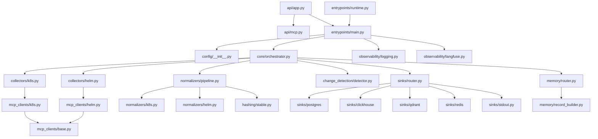
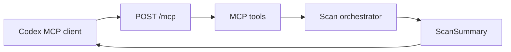
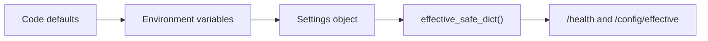
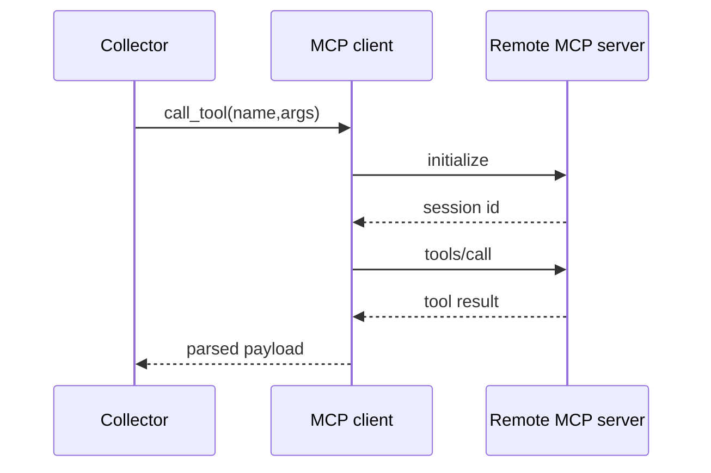
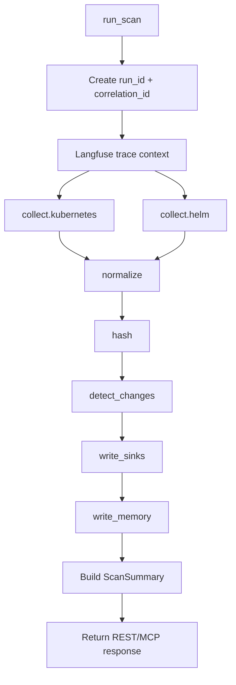
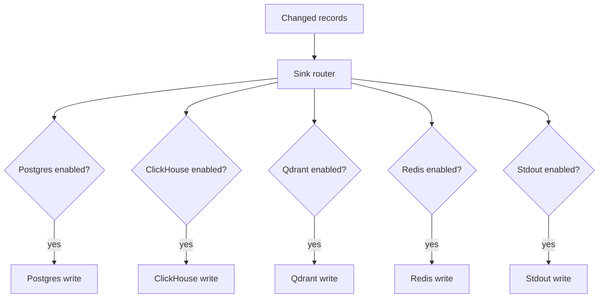
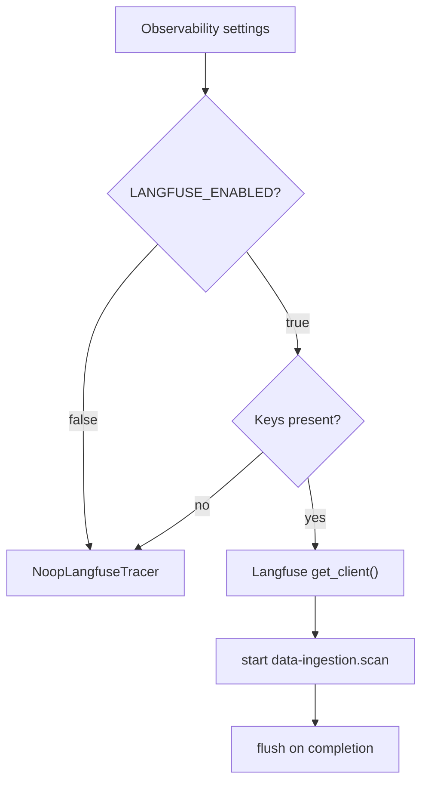
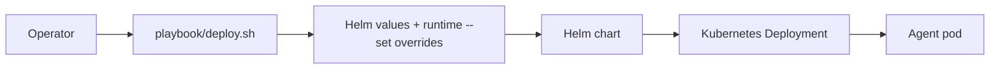

# BOS Genesis K8s Data Ingestion Agent - Low Level Design

**Document status:** Implemented baseline  
**Package:** `bosgenesis_k8s_data_ingestion_agent`

---

## 1. Module Map



---

## 2. Entry Points

### 2.1 REST API

| Endpoint | Method | Function |
|---|---:|---|
| `/health` | GET | Returns service health and safe effective config. |
| `/scan/run` | POST | Runs an on-demand scan. |
| `/scan/latest` | GET | Returns latest in-memory scan summary. |
| `/config/effective` | GET | Returns redacted config. |

### 2.2 MCP API

Mounted at:

```text
/mcp
```

Tools:

| MCP tool | Purpose |
|---|---|
| `data_ingestion_health` | Health and safe config. |
| `data_ingestion_run_scan` | On-demand scan. |
| `data_ingestion_latest_scan` | Latest summary. |
| `data_ingestion_effective_config` | Redacted config. |



---

## 3. Configuration Model

Settings are loaded from defaults and environment variables. Secret values are redacted in safe output.



Key groups:

- Agent settings: namespace, startup run, interval, strict sink behavior.
- API settings: host, port, MCP allowed hosts.
- MCP settings: K8s/Helm URLs, host headers, timeouts.
- Sink settings: Postgres, ClickHouse, Qdrant, Redis, stdout.
- Observability settings: Langfuse and optional future SigNoz.

---

## 4. MCP Client Design

The base MCP client handles Streamable HTTP sessions, protocol initialization, tool calls, timeout handling, and host headers.



Read-only policy is enforced by using allowlisted client methods and tests that deny mutation tools.

---

## 5. Orchestrator Flow



The returned summary includes `trace_ids.langfuse` when Langfuse is enabled and initialized.

---

## 6. Sink Router



Non-strict mode logs sink errors and continues. Strict mode can fail the scan when an enabled sink fails.

---

## 7. Langfuse Implementation

`observability/langfuse.py` is intentionally optional. If Langfuse is disabled, credentials are missing, or the package is unavailable, the agent falls back to a no-op tracer.



Required runtime values:

```text
LANGFUSE_ENABLED=true
LANGFUSE_BASE_URL=http://langfuse-web.bosgenesis.svc.cluster.local:3000
LANGFUSE_PUBLIC_KEY=<secret>
LANGFUSE_SECRET_KEY=<secret>
```

---

## 8. Helm Chart and Deploy Script

Helm values and templates provide the runtime config. `playbook/deploy.sh` can prompt for sink selection or consume environment overrides.



Supported sink selection:

- `all`
- `none`
- comma/space list such as `postgres,clickhouse`
- individual environment overrides such as `POSTGRES_ENABLED=false`

---

## 9. Langflow Files

| File | Type | Behavior |
|---|---|---|
| `langflow/data-ingestion-agent-architecture.json` | Visualization-only | Shows architecture and data flow. |
| `langflow/data-ingestion-agent-status-flow.json` | Working read-only flow | Calls `/health` or `/scan/latest`. |

The working Langflow flow intentionally does not call `/scan/run`.

---

## 10. Test Coverage

Current tests cover:

- Configuration defaults and env override.
- Redaction of secret settings.
- Orchestrator scan summary and trace id propagation.
- MCP policy and client behavior.
- Collectors, normalizers, hashing, change detection.
- Sink adapters and routers.
- API and end-to-end flow tests.
