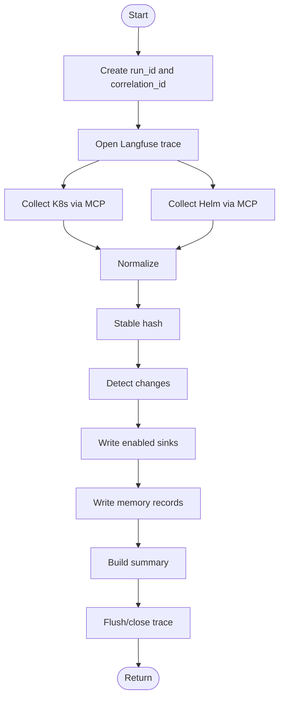
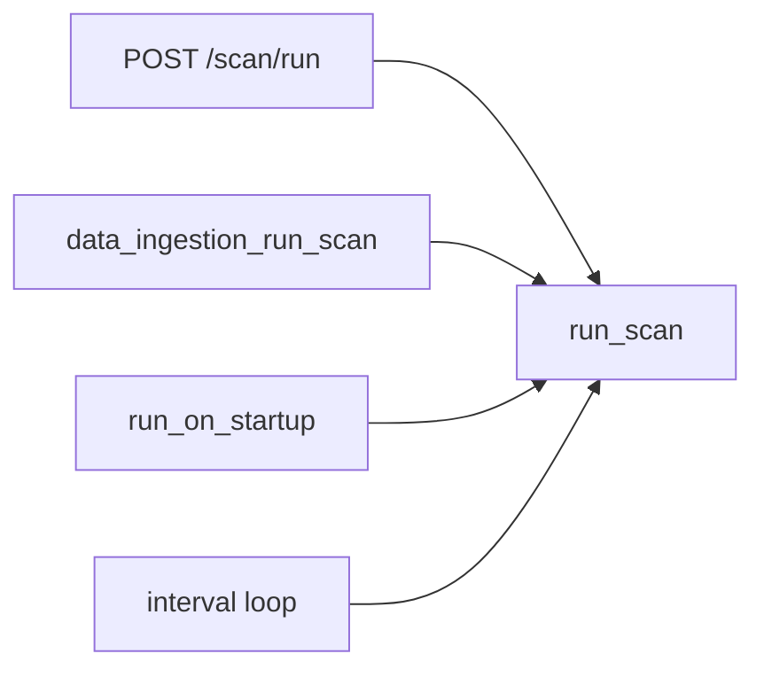
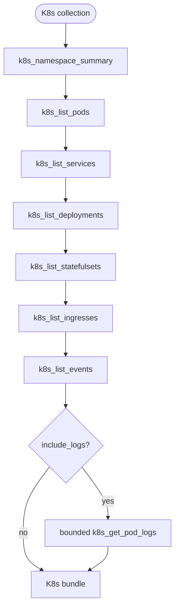
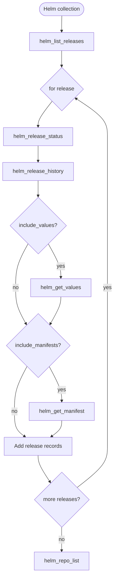
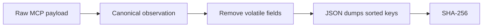
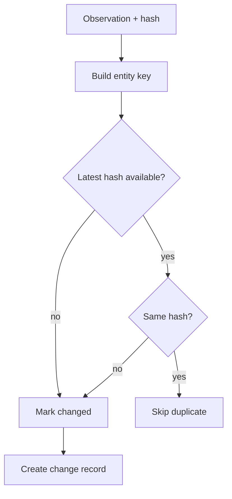
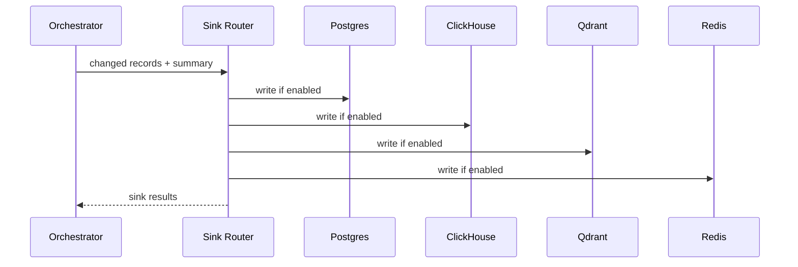
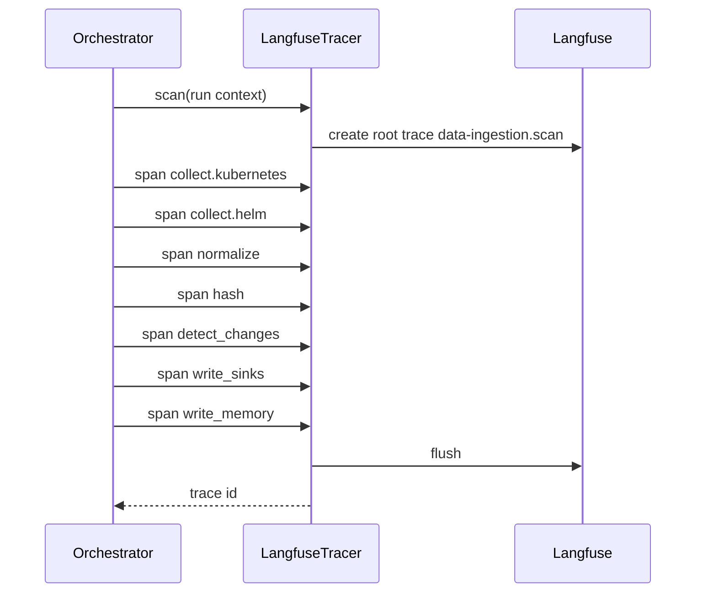
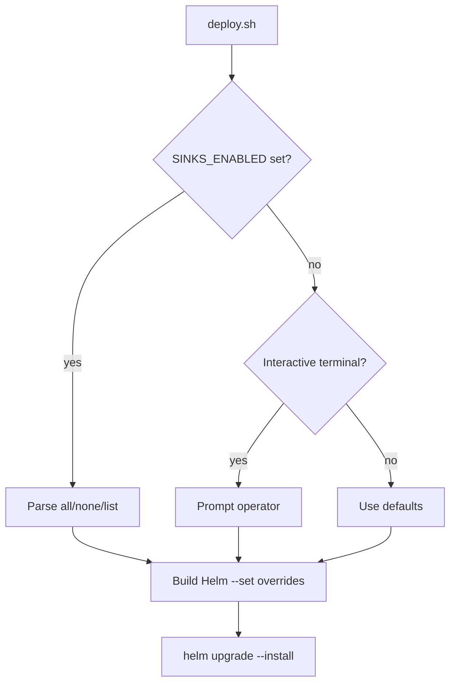
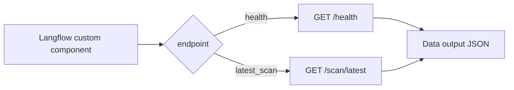

# BOS Genesis K8s Data Ingestion Agent - Algorithm Design

**Document status:** Implemented baseline

---

## 1. Core Scan Algorithm

```text
trigger scan
  -> create run context
  -> start Langfuse trace when enabled
  -> collect Kubernetes state through K8s MCP
  -> collect Helm state through Helm MCP
  -> normalize records
  -> compute stable hashes
  -> detect changed records
  -> write enabled sinks
  -> write memory records
  -> close trace
  -> return scan summary
```



---

## 2. Trigger Algorithm



Inputs:

- `trigger_type`
- `triggered_by`
- `include_logs`
- `include_manifests`
- `include_values`
- `stream_result`

Defaults keep heavy data collection disabled.

---

## 3. Kubernetes Collection



The collector uses MCP read tools only. It does not access Secrets and does not call mutation tools.

---

## 4. Helm Collection



The agent does not call Helm install, upgrade, rollback, uninstall, or repository mutation tools.

---

## 5. Normalization and Hashing



Hash excludes fields that do not represent meaningful state, such as collection timestamp, run id, and correlation id.

---

## 6. Change Detection



Entity key format:

```text
namespace/source/entity_type/entity_name
```

---

## 7. Sink Write Algorithm



In non-strict mode, a sink failure is recorded but does not fail the whole scan.

---

## 8. Langfuse Trace Algorithm



The trace id is returned as:

```json
{
  "trace_ids": {
    "langfuse": "..."
  }
}
```

---

## 9. Deploy Sink Selection Algorithm

`playbook/deploy.sh` defaults to all major sinks enabled. In interactive mode it can prompt for sink selection.



---

## 10. Langflow Working Flow Algorithm



This working flow is intentionally read-only and does not call `/scan/run`.
