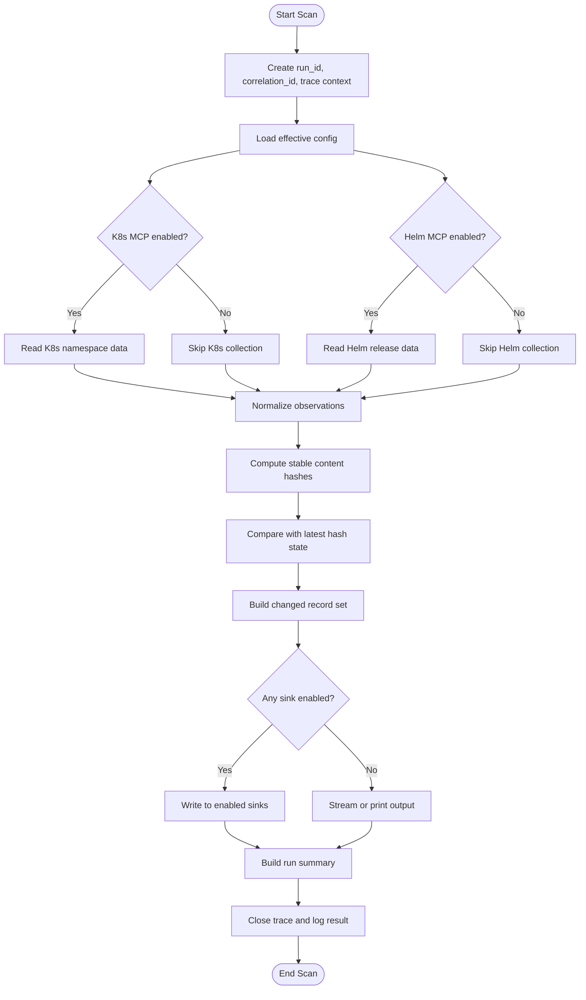
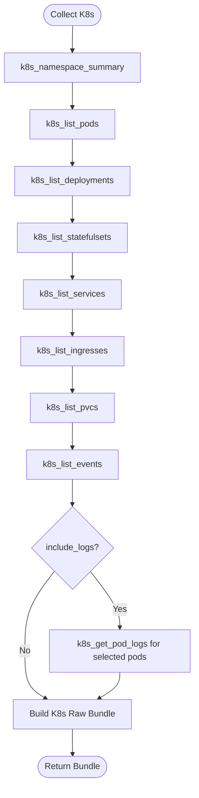
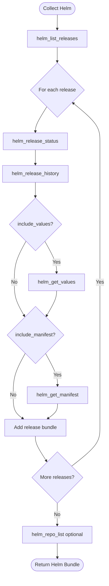
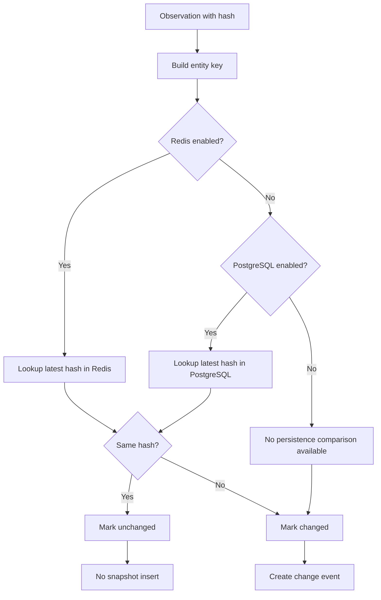
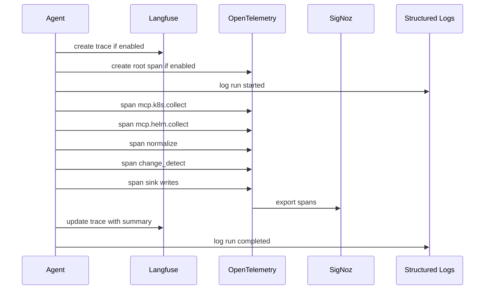
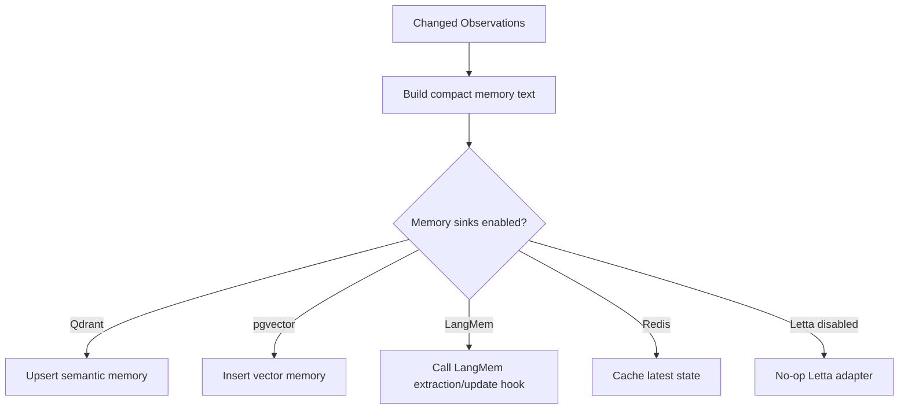
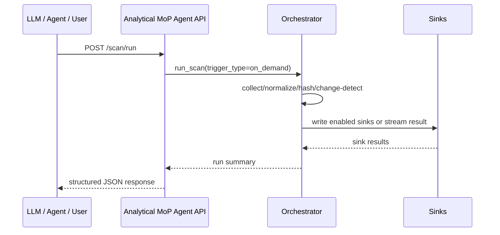

# Analytical MoP Agent — Algorithm and Processing Design

**Document status:** Draft v1.0  
**Target platform:** BOS Genesis / BOS AI Studio  
**Agent name:** `analytical-mop-agent`  

---

## 1. Core Algorithm Summary

The Analytical MoP Agent repeatedly performs this loop:

```text
Trigger scan
  → collect Kubernetes data through K8s MCP
  → collect Helm data through Helm MCP
  → normalize data
  → compute stable hashes
  → compare with latest known hashes
  → persist only changed observations
  → write analytical facts
  → write optional memory records
  → emit traces
  → return run summary
```

It is an ETL and evidence-generation agent, not a decision or remediation agent.

---

## 2. Main Scan Algorithm



---

## 3. Pseudocode — Main Loop

```text
function run_agent():
    settings = load_settings()
    initialize_observability(settings)
    initialize_sinks(settings)

    if settings.agent.run_on_startup:
        run_scan(trigger_type="startup")

    every settings.agent.scan_interval_seconds:
        run_scan(trigger_type="scheduled")
```

```text
function run_scan(trigger_type):
    run_context = create_run_context(trigger_type)
    start_trace(run_context)

    try:
        raw_bundles = []

        if config.mcp.k8s_inspector.enabled:
            raw_bundles.append(collect_k8s(run_context))

        if config.mcp.helm_manager.enabled:
            raw_bundles.append(collect_helm(run_context))

        observations = normalize_all(raw_bundles)
        hashed_observations = compute_hashes(observations)
        changed_records = detect_changes(hashed_observations)

        if any_sink_enabled():
            write_to_enabled_sinks(run_context, changed_records, hashed_observations)
        else:
            stream_or_print(run_context, hashed_observations)

        summary = build_summary(run_context, observations, changed_records)
        mark_run_success(summary)
        return summary

    except Exception as error:
        summary = build_failure_summary(run_context, error)
        handle_failure(summary)
        return summary

    finally:
        close_trace(run_context)
```

---

## 4. Kubernetes Collection Algorithm



Selection rules for logs in v1:

- Do not collect all logs by default.
- Collect logs only if `include_logs=true`.
- Limit by tail lines and max pods.
- Prefer pods with non-running status, restarts, or recent warning events.

---

## 5. Helm Collection Algorithm



---

## 6. Normalization Algorithm

### 6.1 Goal

Raw MCP payloads may be different across tools. The normalizer converts them into a common observation format.

### 6.2 Generic Observation

```text
Observation:
  observation_id
  run_id
  source
  namespace
  entity_type
  entity_name
  entity_uid
  observed_at
  status_summary
  raw_payload
  normalized_payload
  hash_input
  content_hash
```

### 6.3 Normalization Pseudocode

```text
function normalize_all(raw_bundles):
    observations = []

    for bundle in raw_bundles:
        if bundle.source == "k8s_mcp":
            observations.extend(normalize_k8s_bundle(bundle))
        if bundle.source == "helm_mcp":
            observations.extend(normalize_helm_bundle(bundle))

    return observations
```

---

## 7. Stable Hash Algorithm

### 7.1 Hash Requirements

The hash should change when operationally meaningful state changes, but not when collection time changes.

### 7.2 Fields Excluded from Hash

Common excluded fields:

```text
observed_at
collection_timestamp
run_id
correlation_id
resource_version if too volatile
managed_fields if present
last_transition_time if too noisy for v1
```

### 7.3 Hash Pseudocode

```text
function compute_content_hash(observation):
    hash_payload = deep_copy(observation.normalized_payload)
    remove_non_hash_fields(hash_payload)
    serialized = json_serialize(hash_payload, sort_keys=True, compact=True)
    return sha256(serialized)
```

---

## 8. Change Detection Algorithm



Entity key format:

```text
namespace/source/entity_type/entity_name
```

For Helm:

```text
namespace/helm_mcp/release/release_name
```

---

## 9. Persistence Algorithm

### 9.1 Sink Router Pseudocode

```text
function write_to_enabled_sinks(run_context, changed_records, all_records):
    sink_results = []

    for sink in enabled_sinks:
        try:
            if sink.accepts_changed_only:
                result = sink.write(run_context, changed_records)
            else:
                result = sink.write(run_context, all_records)
            sink_results.append(result)
        except Exception as error:
            trace_sink_error(sink.name, error)
            if config.agent.strict_mode:
                raise error
            sink_results.append(mark_sink_failed(sink.name, error))

    return sink_results
```

### 9.2 PostgreSQL Write Rules

- Always insert or update scan run summary.
- Insert changed resource snapshots only.
- Insert changed Helm snapshots only.
- Insert change events.
- Optionally insert vector records if pgvector enabled.

### 9.3 ClickHouse Write Rules

- Insert one scan fact per run.
- Insert resource facts for changed records.
- Do not insert large raw payloads.
- Use batch insert where possible.

### 9.4 Redis Write Rules

- Store latest hash by entity key.
- Store latest summary by namespace.
- Use TTL only if configured.

---

## 10. Observability Algorithm



### 10.1 Trace Status Rules

| Condition | Status |
|---|---|
| All enabled collectors and sinks succeed | `success` |
| At least one optional collector/sink fails but run continues | `partial_success` |
| Required collector fails and no data collected | `failed` |
| Configuration invalid | `failed` |

---

## 11. Memory Routing Algorithm



Memory text examples:

```text
Namespace bosgenesis deployment analytical-mop-agent changed status to Available with 1/1 replicas.
Helm release langflow revision changed to 4 with status deployed.
Pod memory-agent restarted count changed from 0 to 1.
```

---

## 12. On-Demand Invocation Algorithm



---

## 13. Deleted or Missing Resource Candidate Algorithm

This is not alerting. It only records candidates for later analysis.

```text
function detect_missing_candidates(previous_keys, current_keys):
    missing = previous_keys - current_keys
    for key in missing:
        create_change_event(
            change_type="deleted_or_missing_candidate",
            entity_key=key,
            details={"note": "resource not observed in current scan"}
        )
```

Rules:

- Do not alert.
- Do not call it a confirmed deletion unless confirmed across multiple scans or supported by event history.
- Store as candidate event for later ML/analytics.

---

## 14. Performance Considerations

| Concern | Design Response |
|---|---|
| Large number of pods | Batch normalize and hash. |
| Too many logs | Logs disabled by default; bounded collection only. |
| Database growth | Store changed snapshots only. |
| Repeated scans | Redis/latest hash cache optional. |
| MCP latency | Per-tool timeout and partial success. |
| Multiple overlapping runs | In-process lock in v1; distributed lock later. |

---

## 15. Final Algorithm Decision

The first implementation should prioritize correctness and auditability over advanced intelligence.

Recommended v1 behavior:

```text
Periodic scan every 5 minutes
Read K8s MCP + Helm MCP
Normalize + hash
Write changed snapshots to PostgreSQL
Write compact facts to ClickHouse
Trace with Langfuse + SigNoz
No anomaly detection
No alerting
No mutation
No Letta runtime use
```
