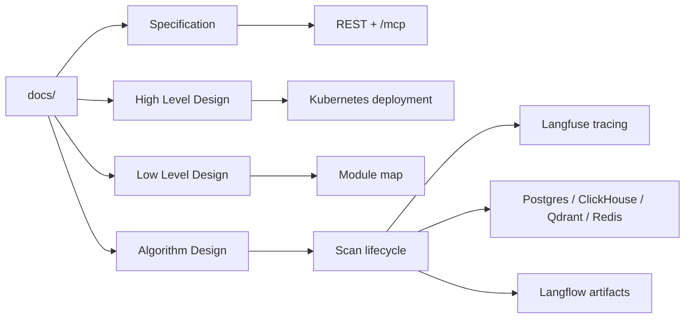

# Documentation Index

This folder contains the primary design documentation for `bosgenesis-k8s-data-ingestion-agent`.

## Current Documents

| File | Purpose |
|---|---|
| `01_SPEC_ANALYTICAL_MOP_AGENT.md` | Product and implementation specification. |
| `02_HLD_ANALYTICAL_MOP_AGENT.md` | High-level architecture and deployment design. |
| `03_LLD_ANALYTICAL_MOP_AGENT.md` | Low-level module, API, MCP, sink, and tracing design. |
| `04_ALGORITHM_ANALYTICAL_MOP_AGENT.md` | Scan, collection, hashing, sink, tracing, and deploy algorithms. |
| `SPEC.md` | This index. |

## Implemented Capabilities Covered

## Related Repository Files

- `README.md`
- `PROJECT_STRUCTURE.md`
- `TECH_STACK.md`
- `playbook/deploy.sh`
- `playbook/deployment/DEPLOYMENT.md`
- `charts/bosgenesis-k8s-data-ingestion-agent/values.yaml`
- `langflow/README.md`
- `langflow/data-ingestion-agent-architecture.json`
- `langflow/data-ingestion-agent-status-flow.json`

## Documentation Rules

- Keep runtime URLs aligned with Helm values and `deploy.sh`.
- Use in-cluster service DNS for pod-to-service calls.
- Keep secrets out of documentation examples.
- Clearly mark read-only flows versus scan-triggering flows.
- Update diagrams when MCP tools, sinks, or observability behavior changes.
